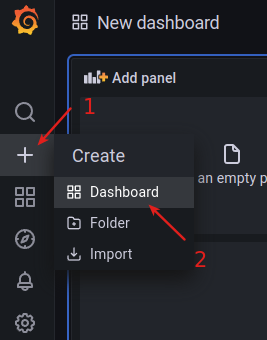
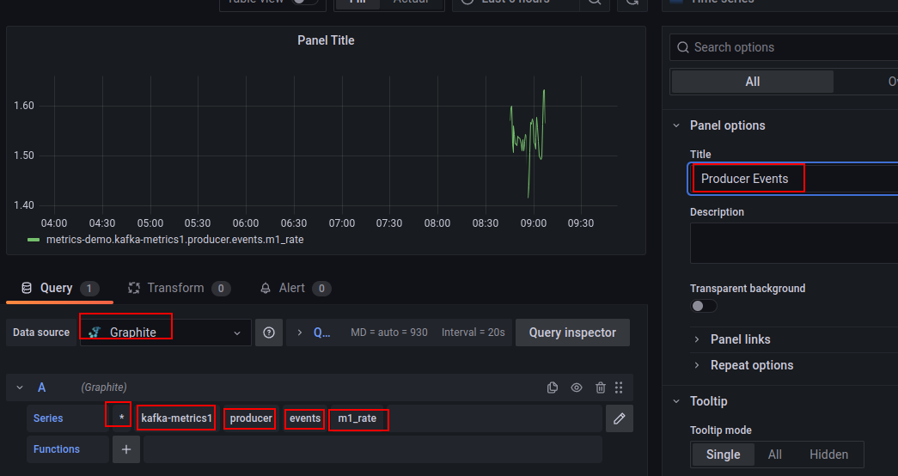
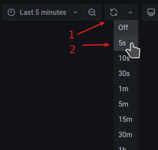
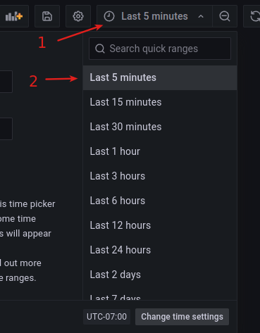

<link rel='stylesheet' href='assets/css/main.css'/>

# Publishing custom metrics

## Overview

In this lab, we will publish our own metrics

## Runtime

30 mins

## Step-1: Start the Kafka + Metrics Stack

Make sure the metrics stack is running

```bash
cd  kafka-in-docker
bash  start-kafka-metrics.sh
```

Make sure all components are up

## Step-2: Import `metrics` Project

Project path: `kafka-advanced-labs/labs/metrics`

Import this project as 'existing maven project'

## Step-3: Run Producer with Metrics

Inspect the file : [labs/metrics/src/main/java/x/metrics/ProducerWithMetrics.java](labs/metrics/src/main/java/x/metrics/ProducerWithMetrics.java)

This Producer will publish a metric called **kafka-metrics1.producer.events**

Run the Producer code

## Step-4: Login to Grafana

Use the username/password printed out to login to Grafana.

## Step-5: Build a Custom Dashboard

* Create a **new dashboard**
* Add **a panel**
* Select your data like this
    - Datasource : **graphite**
    - Series  : **\*.kafka-metrics1.producer.events.m1_rate**
    - Set title as **Producer events**
    - Click **Apply**
* Set the interval to **5 minutes**
* Set auto refresh rate to **5 seconds**

Enjoy!







